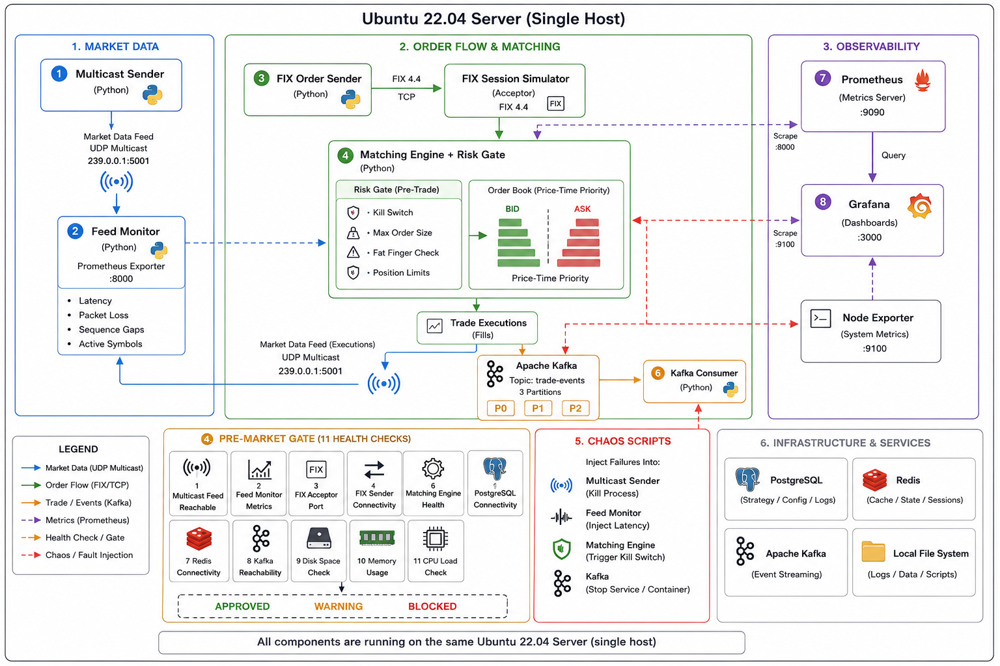
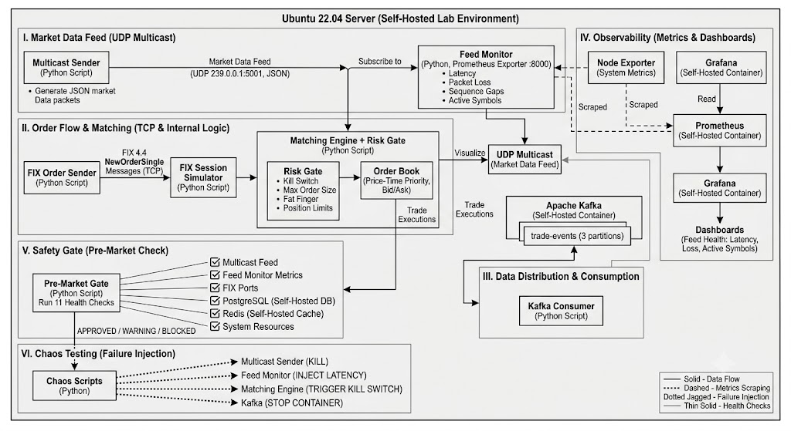

# Trading Infra Lab



A single-host trading systems laboratory that recreates the critical components of electronic trading infrastructure:

* Market data distribution
* FIX order entry
* Pre-trade risk controls
* Matching engine execution
* Event streaming
* Persistence
* Monitoring and alerting
* Failure injection and recovery testing

The system runs on a single Ubuntu 22.04 host and is intentionally operated under constrained resources to study operational behavior, failure modes, observability gaps, and recovery characteristics.

The objective is not to build a feature-complete exchange. The objective is to understand how trading infrastructure behaves under real operational stress.

---

# Overview

Most trading-system projects demonstrate happy-path functionality. This lab focuses on what happens when things fail.

The environment combines market data, order flow, risk validation, matching, persistence, monitoring, and chaos testing into a single deployable system. Components are intentionally broken, restarted, degraded, and audited to validate recovery behavior and expose hidden assumptions.

Key questions explored:

* What fails first under resource pressure?
* Which failures are immediately visible versus silent?
* How effective are restart policies and health checks?
* How quickly can the system detect and recover from degraded conditions?
* Which monitoring signals are actually useful during incidents?

---

# Architecture



## High-Level Flow

```text
                    Market Data Feed
                    (UDP Multicast)
                            |
                            v
                    Feed Monitor
                            |
                            v
                 Prometheus / Grafana


 FIX Client
     |
     v
+------------+
| Risk Gate  |
+------------+
     |
     v
+------------+
| Matching   |
| Engine     |
+------------+
     |
     v
+------------+
| Kafka      |
+------------+
     |
     v
+------------+
| PostgreSQL |
+------------+
```

## Core Data Path

1. Market data is distributed over UDP multicast.
2. Feed Monitor validates packet flow, latency, and sequence continuity.
3. FIX clients submit orders.
4. Orders pass through pre-trade risk validation.
5. Approved orders enter the matching engine.
6. Execution events are published to Kafka.
7. Trade records are persisted to PostgreSQL.
8. Prometheus and Grafana provide operational visibility across the stack.

---

# Repository Structure

```text
trading-infra-lab/
│
├── exchange/
│   ├── matching_engine.py
│   ├── order_book.py
│   ├── risk_gate.py
│   └── test_exchange.py
│
├── market_data/
│   ├── sender.py
│   ├── receiver.py
│   └── feed_monitor.py
│
├── fix/
│   ├── simulator.py
│   └── sessions/
│
├── chaos/
│   ├── 01_feed_blackout.py
│   ├── 02_latency_injection.py
│   ├── 04_consumer_crash.py
│   └── control_panel.py
│
├── monitoring/
│   ├── prometheus/
│   ├── grafana/
│   └── dashboards/
│
├── pre_market/
│   └── checks.py
│
├── docs/
│   ├── postmortems/
│   └── architecture/
│
└── README.md
```

---

# Components

## Market Data Feed

A multicast-based market data simulator designed to reproduce feed distribution and monitoring patterns.

Features:

* UDP multicast transport
* Sequence tracking
* Gap detection
* Latency measurement
* Multiple instrument support

Current symbols:

* AAPL
* MSFT
* GOOG
* TSLA

Example update:

```json
{
  "symbol": "AAPL",
  "price": 211.42,
  "seq": 10421,
  "timestamp": 1750012345.182
}
```

---

## FIX Protocol Layer

Order entry is simulated using FIX 4.4 sessions.

Capabilities:

* NewOrderSingle handling
* ExecutionReport generation
* Session persistence
* Auto-recovery via systemd
* Sender/receiver simulation

Ports:

```text
9876 - FIX sender
9877 - FIX receiver
```

---

## Pre-Trade Risk Gate

All orders are validated before reaching the matching engine.

Checks include:

* Kill switch
* Maximum order size
* Fat-finger protection
* Position limits
* Audit logging

Example decision flow:

```text
New Order
    |
    v
Risk Validation
    |
    +--> Reject
    |
    +--> Approve
            |
            v
     Matching Engine
```

---

## Matching Engine

A simplified exchange matching engine implementing price-time priority.

Features:

* Limit orders
* Partial fills
* Deterministic execution
* O(1) order cancellation lookup
* Per-symbol order books

Supported functionality:

* New orders
* Cancel orders
* Partial executions
* Full executions

---

## Kafka Event Stream

Trade lifecycle events are published to Kafka.

Topics:

```text
NEW_ORDER
EXECUTION_REPORT
TRADE
```

Example flow:

```text
Order Submitted
       |
       v
 NEW_ORDER
       |
       v
Matching Engine
       |
       v
EXECUTION_REPORT
       |
       v
TRADE
       |
       v
PostgreSQL
```

Consumer:

```text
trade_persister.py
```

---

## Observability

### Feed Monitor

Prometheus exporter exposing feed health and latency metrics.

Metrics:

```text
feed_alive
feed_latency_ms
feed_packets_total
feed_dropped_total
feed_gap_events_total
feed_symbols_active
```

### Grafana Dashboards

Infrastructure dashboard:

* CPU utilization
* Memory utilization
* Disk usage
* Load average

Market data dashboard:

* Feed latency
* Packet throughput
* Sequence gaps
* Feed staleness

---

## Pre-Market Health Gate

A consolidated operational readiness check executed before trading activity.

Validation categories:

* Feed availability
* FIX session status
* Database connectivity
* Queue health
* Resource utilization
* Error thresholds

Possible outcomes:

```text
APPROVED
WARNING
BLOCKED
```

---

# Chaos Engineering

A primary goal of the lab is validating behavior during failure conditions.

## Implemented Scenarios

| Scenario                | Status   |
| ----------------------- | -------- |
| Feed Blackout           | Complete |
| Latency Injection       | Complete |
| Consumer Crash          | Complete |
| Kafka Broker Stop       | Complete |
| Quote Staleness Audit   | Complete |
| CPU Exhaustion Analysis | Complete |

## Planned Scenarios

| Scenario                    | Status  |
| --------------------------- | ------- |
| Risk Kill Switch Validation | Planned |
| Disk Exhaustion             | Planned |
| Memory Pressure             | Planned |
| Service Dependency Failure  | Planned |

## Running a Scenario

Inject failure:

```bash
python3 chaos/01_feed_blackout.py inject
```

Recover:

```bash
python3 chaos/01_feed_blackout.py recover
```

Web control panel:

```bash
python3 chaos/control_panel.py
```

```text
http://<server-ip>:8080
```

---

# Quick Start

## Prerequisites

* Ubuntu 22.04
* Python 3.10+
* Docker
* systemd

Install dependencies:

```bash
pip install kafka-python requests fastapi uvicorn prometheus-client
```

## Start Services

Market data and FIX services:

```bash
sudo systemctl start multicast-sender
sudo systemctl start feed-monitor
sudo systemctl start fix-simulator
```

Infrastructure services:

```bash
docker compose up -d
```

## Verify System Health

```bash
python3 pre_market/checks.py
```

Expected output:

```text
APPROVED
```

---

# Testing

Matching engine tests:

```bash
cd exchange
python3 test_exchange.py
```

Expected:

```text
6/6 tests passing
```

---

# Operational Findings

Several recurring patterns emerged during testing and incident analysis.

### CPU Starvation Is More Dangerous Than Process Failure

On small burstable instances, CPU credit exhaustion caused broader degradation than isolated service crashes.

### Monitoring Requires Independent Validation

Single-point measurements produced blind spots during latency investigations. Independent measurements provided more reliable operational signals.

### Same-Host Networking Behaves Differently

Local multicast traffic invalidated assumptions made during packet-loss testing and required adjustments to testing methodology.

### Restart Policies Can Amplify Failures

Aggressive restart behavior without resource constraints increased contention and accelerated cascading failures.

### Small Configuration Errors Scale Quickly

Permissions, service definitions, environment variables, and dependency mismatches frequently produced disproportionate operational impact.

---

# Postmortems

Documented incident investigations are available under:

```text
docs/postmortems/
```

Current postmortems include:

* Feed blackout recovery
* Latency injection analysis
* CPU exhaustion investigation
* Memory pressure investigation
* Kafka dependency isolation validation
* Quote staleness audit

Each postmortem includes:

* Timeline
* Root cause
* Impact
* Detection
* Resolution
* Follow-up actions

---

# Roadmap

* [ ] Complete remaining chaos scenarios
* [ ] Linux networking deep dive
* [ ] Resource isolation experiments (cgroups)
* [ ] Additional exchange simulation workloads
* [ ] Video walkthrough
* [ ] Public open-source release

---

# Status

Active experimental system.

The project is continuously tested, broken, repaired, and documented. The primary output is not uptime—it is operational understanding of trading infrastructure under failure conditions.

---

# Author

**Ibrahim Cisse**

Infrastructure, platform, and trading systems engineering.

Production experience across fintech and exchange environments, with a focus on reliability, observability, and operational resilience.
